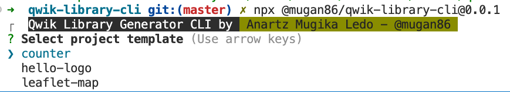

# Qwik Library Generator from  CLI


Package: https://www.npmjs.com/package/@mugan86/qwik-library-cli


## ESPAÑOL

Generador de proyectos por consola para agilizar el proceso de creación de nuevos proyectos de librería en Qwik con configuraciones que se han probado y adaptado a las necesidades de producción

## Instrucciones de uso

Para poder trabajar con el CLI y generar proyectos de librería con agilidad, debemos de seguir las siguientes instrucciones.

### Iniciar la ejecución

#### Ejecutar sin instalar nada

Descargamos el fichero `mugan86-qwik-library-cli-0.0.1.tgz` del directorio de raíz y ejecutamos:

```bash
npx ./mugan86-qwik-library-cli-0.0.1.tgz
```

#### Instalando el CLI en nuestro equipo

Ejecutamos para instalar globalmente:

```bash
npm i -g @mugan86/qwik-library-cli
```

Y una vez instalado, ejecutaremos el siguiente comando, que será accesible desde cualquier parte de nuestro equipo:

```bash
qwik-library-cli
```

### Trabajando con el CLI en marcha

Una vez ejecutado el proyecto de CLI desde nuestra opción preferida (sin instalar / instalando), en los dos casos nos debería de mostrar una ventana como la que veís a continuación:




Tenemos la opción de seleccionar los proyectos que están almacenados en `src/templates`

¿Qué contiene cada proyecto?

- `hello-logo`: Librería muy básica donde encontramos los componentes que se nos proporciona por defecto en la documentación oficial. A diferencia de lo que podemos obtener en la plantilla oficial se implementan unas configuraciones adicionales para mejorar y resolver algunos problemas encontrados como la generación de types entre otras cosas.
- `leaflet-map`: Plantilla ideal para iniciar una librería de componentes basada para proyectos de mapas. En este caso obtendremos lo básico que se necesita para visualizar un mapa, con sus dependencias y configuraciones que son necesarias para su correcto funcionamiento. Basado en [este artículo](https://medium.com/@mugan86/qwik-integrar-mapas-con-leaflet-32435b75b4f6) escrito hace un tiempo.
- `counter`: Proyecto de contador. Ejemplo de contador / descontador donde trabajamos haciendo uso de un custom hook, que nos sirva de base para poder inspirarno y crear proyectos más avanzados.

¿Tienes alguna sugerencia y / o idea de mejora? ¿Quieres colaborar?

## Contacto

En esta sección os facilito las diferentes formas de seguirme y/o poder contactarme para colaborar (no consultorías, recibo e-mails de este estilo para ayudar a crear proyectos y gratis, no tengo tiempo)

- Github: [mugan86](https://github.com/mugan86)
- Medium Tech Blog: [mugan86](https://mugan86.medium.com/)
- Youtube: [mugan86](https://www.youtube.com/mugan86)
- Twitter: [mugan86](https://twitter.com/mugan86)
